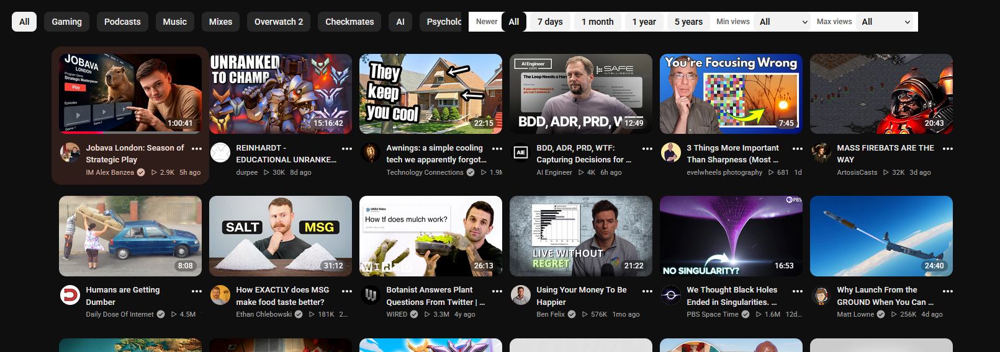
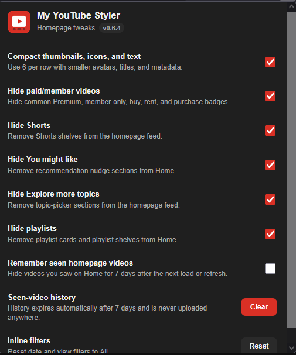

# My YouTube Styler

My YouTube Styler is a local Firefox WebExtension that makes YouTube's Home and Subscriptions feeds denser, quieter, and easier to scan. It keeps the normal YouTube experience, but trims visual weight, adds feed filters, and lets you hide sections that tend to interrupt browsing.

The extension runs only in your browser, stores settings locally, and does not make network requests.

## Features

- Shows 6 videos per row on the YouTube Home and Subscriptions feeds.
- Shrinks card avatars, title text, and metadata text slightly.
- Colors visible view counts and video ages from green to red based on popularity and freshness.
- Optionally spells out video age units, with week, month, and year ages shown in bold.
- Adds date filters for videos newer than 7 days, 1 month, 1 year, or 5 years.
- Adds minimum and maximum view-count filters from 1K through 1B views.
- Optionally auto-remembers videos you have already seen and hides them on the next feed load or refresh, with a 7-day rolling history.
- Lets you Alt+click a Home or Subscriptions feed video to add it to a local not interested list and hide it until that list is cleared.
- Hides paid-promotion thumbnail overlays and routes thumbnail-overlay clicks to the video page.
- Hides Shorts, topic shelves, YouTube featured sections, playlists, Playables, Subscriptions Latest/Most relevant sections, YouTube's bottom-right miniplayer, "You might like" sections, and common paid/member-only badge variants.
- Adds toolbar popup toggles for:
  - Compact thumbnails, icons, and text
  - Color views and age
  - Emphasize dates
  - Hide paid/member videos
  - Open video from thumbnail clicks
  - Hide Shorts
  - Hide You might like sections
  - Hide Explore more topics
  - Hide YouTube featured sections
  - Hide playlists
  - Hide Playables
  - Hide subscription Latest section
  - Hide miniplayer
  - Auto-remember seen feed videos

On Home, the filters share the category-chip row, with the chips constrained to the left half and the extension controls on the right. On Subscriptions, where the chip row is not available, the extension adds a right-aligned sticky filter anchor above the feed.

The extension is scoped to `https://www.youtube.com/*`. Its JavaScript only operates on the YouTube Home path (`/`) and Subscriptions path (`/feed/subscriptions`), so it keeps working when YouTube navigates between pages without a full reload.

## Examples

Firefox v0.6.4 examples:





## Install In Firefox

During development, the quickest way to try the extension is as a temporary Firefox add-on.

1. Download or clone this repo.
2. Open Firefox.
3. Go to `about:debugging#/runtime/this-firefox`.
4. Click **Load Temporary Add-on...**.
5. Select `extension/manifest.json` from this repo.
6. Open or reload `https://www.youtube.com/` or `https://www.youtube.com/feed/subscriptions`.

Temporary add-ons are unloaded when Firefox restarts. During development, reload the temporary add-on from the same Firefox debugging page after pulling changes or editing extension files.

## Sign For Firefox

For personal daily use in regular Firefox, sign the extension as an unlisted/self-distributed add-on. This submits the package to Mozilla for signing, but it does not create a public AMO listing.

```powershell
npm install
npm run lint
```

Create API credentials in the AMO Developer Hub, then set them in the current PowerShell session:

```powershell
Remove-Item Env:WEB_EXT_API_KEY -ErrorAction SilentlyContinue
Remove-Item Env:WEB_EXT_API_SECRET -ErrorAction SilentlyContinue

$env:WEB_EXT_API_KEY = (Read-Host "Paste JWT issuer").Trim()

$secret = Read-Host "Paste JWT secret" -AsSecureString
$ptr = [Runtime.InteropServices.Marshal]::SecureStringToBSTR($secret)
$env:WEB_EXT_API_SECRET = ([Runtime.InteropServices.Marshal]::PtrToStringBSTR($ptr)).Trim()
[Runtime.InteropServices.Marshal]::ZeroFreeBSTR($ptr)
```

Submit and sign the extension for self-distribution:

```powershell
npm run sign:firefox:unlisted
```

The signed `.xpi` is written to `web-ext-artifacts/`. Open that file in Firefox to install it permanently. After signing, clear the credentials from the terminal session:

```powershell
Remove-Item Env:WEB_EXT_API_KEY
Remove-Item Env:WEB_EXT_API_SECRET
```

To keep a named local copy of a successful signed build, copy it into `signed-releases/firefox/`. That folder is ignored by Git because signed packages are generated release artifacts:

```powershell
New-Item -ItemType Directory -Path signed-releases/firefox -Force
Copy-Item web-ext-artifacts/*.xpi signed-releases/firefox/
```

For automatic self-hosted updates, Firefox reads `updates/firefox.json` from the raw GitHub URL in `extension/manifest.json`. Before signing a release, update that JSON file to the new version and GitHub release asset URL. After signing, upload the signed `.xpi` to the matching GitHub release using the exact filename from `update_link`.

The signed Firefox v0.7.2 XPI was saved locally at `signed-releases/firefox/d286352590454dc89781-0.7.2.xpi`.

For each update, bump `extension/manifest.json`'s `version`, update `updates/firefox.json`, rerun the signing command, install the new signed `.xpi`, and preserve a copy in `signed-releases/firefox/` if desired. When using AMO Developer Hub manually, upload updates from the existing add-on's version page; using the new add-on flow with the same Gecko ID produces a duplicate add-on ID error.

If signing fails with `Unauthorized` and `Error decoding signature`, regenerate or recopy the AMO JWT issuer and JWT secret as a matching pair, then rerun the signing command.

You can also create an unsigned local package for inspection with `npm run build`, but regular Firefox will only install the signed `.xpi`.

## Privacy

- No network requests are made by the extension.
- Settings are stored in Firefox extension storage.
- Selected inline date/view filters are stored only in the YouTube tab session.
- Auto seen-video history is opt-in. When enabled, it stores video IDs with last-seen timestamps, prunes entries older than 7 days, and is never uploaded anywhere.
- Local not interested videos are stored separately when you Alt+click a feed video, remain hidden until you clear that list, and are never uploaded anywhere.
- The local not interested list does not use YouTube's own Not interested action or send feedback to YouTube.
- Seen-video history is disabled in private browsing windows, even when the setting is enabled.

## Notes

- The date filter reads the visible relative age text on feed video cards, such as `3 hours ago` or `2 weeks ago`.
- The view filters read visible feed metadata, such as `71 views`, `1.5K views`, or `1.5 million views`.
- Videos with unrecognized or missing age/view text are left visible.
